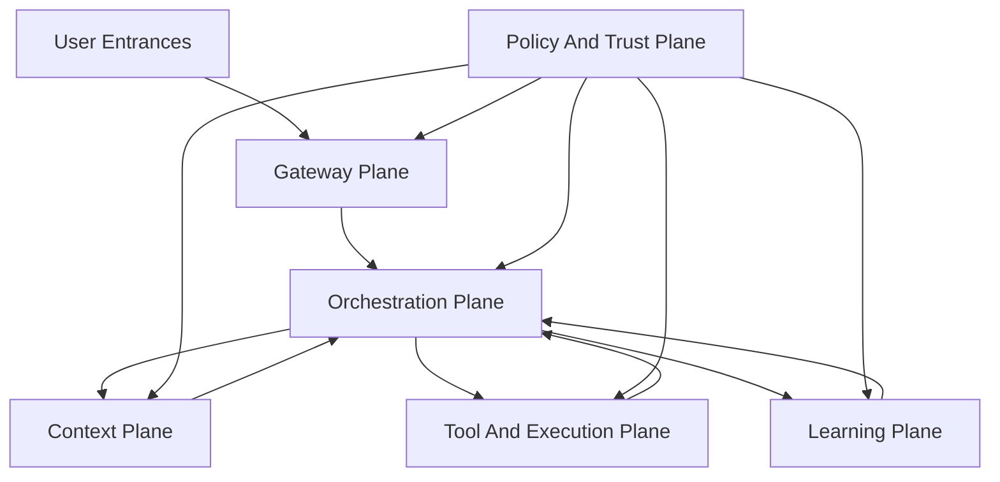

# SpruceAgent: Toward A SuperAgent

## 1. Core Thesis

SpruceAgent is not a fourth Agent harness that merely combines OpenClaw, Hermes Agent, and OpenHuman.

It should evolve into the next layer above them:

> A SuperAgent operating system for future super individuals and super teams: summonable from any entrance, able to learn from every task, grounded in real context, and safe across local devices, cloud sandboxes, personal apps, and team workflows.

The three upstream projects point to three necessary but incomplete directions:

| Project | Solves | Missing Piece |
| --- | --- | --- |
| OpenClaw | Entry and control plane | Deep self-improvement and personal data graph |
| Hermes Agent | Self-improving agent runtime | Product-grade personal UX and omnichannel residency |
| OpenHuman | Personal context and desktop experience | Strong gateway fabric and mature self-evolving runtime |

SpruceAgent should treat them as three roots:

1. OpenClaw gives SpruceAgent the gateway root.
2. Hermes gives SpruceAgent the evolution root.
3. OpenHuman gives SpruceAgent the personal-context root.

The target is a SuperAgent with four fused capabilities:

1. Be reachable anywhere.
2. Remember and understand the user.
3. Improve itself through repeated work.
4. Act under explicit trust, policy, and observability boundaries.

## 2. Product Definition

SpruceAgent is a local-first, personally owned, self-improving AI agent platform.

Its user-facing promise:

> Talk to one agent from any device or channel. It knows your working context, can operate your tools, learns reusable skills from completed tasks, and stays under your control.

SpruceAgent should not start as a giant generalized AGI shell. It should start as a reliable intelligence operating layer for real individual and team work:

- reading and organizing personal context
- planning and executing tasks
- operating local and cloud tools
- remembering preferences and history
- turning repeated workflows into skills
- exposing actions through chat, desktop, CLI, web, and automation triggers

## 3. SuperAgent Architecture

SpruceAgent should be organized around five planes.



### 3.1 Gateway Plane

Inherited primarily from OpenClaw.

Purpose:

- keep SpruceAgent reachable through multiple entrances
- route user messages, events, device signals, and automation triggers
- maintain sessions and identity across channels
- expose local device capabilities as addressable nodes

Entrances:

- desktop app
- CLI
- web UI
- mobile companion
- messaging channels
- browser extension
- webhook/API
- cron and event triggers

Key design rule:

The gateway must not be the brain. It is the nervous system: identity, routing, permissions, sessions, streaming, and event delivery.

### 3.2 Orchestration Plane

Inherited primarily from Hermes Agent.

Purpose:

- own the core agent loop
- select model/provider
- build prompts
- call tools
- run plans
- coordinate subagents
- persist task traces
- recover from failures

Core loop:

1. intake
2. identity and permission check
3. context assembly
4. intent classification
5. planning
6. tool execution
7. observation
8. reflection
9. response
10. memory and skill update

Key design rule:

Every meaningful task should produce an execution trace. Traces are the raw material for memory, debugging, evaluation, and skill learning.

### 3.3 Context Plane

Inherited primarily from OpenHuman.

Purpose:

- connect personal accounts and local files
- normalize heterogeneous data into a durable personal context graph
- retrieve the right context at the right time
- preserve user ownership and local-first storage

Data sources:

- local files and folders
- email
- calendar
- notes
- browser history/bookmarks
- chat apps
- GitHub/GitLab
- Slack/Discord/Teams
- Notion/Obsidian/Google Drive
- task managers and CRMs

Internal representation:

- raw source objects
- normalized markdown chunks
- embeddings
- full-text index
- entity graph
- timeline
- user profile
- project memory
- relationship map
- task history

Key design rule:

Memory is not one thing. SpruceAgent needs at least five memory types:

| Memory Type | Meaning |
| --- | --- |
| Session memory | What happened in the current conversation/task |
| Project memory | What matters inside a workspace or project |
| User memory | Durable preferences, profile, writing style, constraints |
| World/tool memory | What tools exist and how they behave |
| Skill memory | Reusable procedures learned from prior work |

### 3.4 Tool And Execution Plane

Inherited from all three projects, strongest from Hermes.

Purpose:

- provide safe, observable action
- run tools locally, remotely, or in sandboxes
- expose file, shell, browser, API, app, and MCP capabilities

Execution targets:

- local machine
- Docker
- SSH host
- cloud VM
- serverless sandbox
- browser automation
- desktop automation
- MCP servers
- API integrations

Key design rule:

Every tool call must have:

- declared capability
- required permission
- input schema
- output schema
- risk level
- audit log
- replay/debug metadata

### 3.5 Learning Plane

Inherited primarily from Hermes, upgraded by context from OpenHuman.

Purpose:

- convert repeated successful behavior into reusable skills
- improve existing skills from failures and user corrections
- evaluate skills before promotion
- maintain a skill lifecycle

Skill lifecycle:

1. observe repeated workflow
2. extract candidate procedure
3. draft skill
4. run against past traces
5. evaluate success/failure
6. ask user for promotion when risk is meaningful
7. version and publish locally
8. monitor future usage

Key design rule:

SpruceAgent should not silently mutate its own behavior in high-impact domains. Learning can be automatic; promotion should be governed.

### 3.6 Policy And Trust Plane

This is the missing layer that must bind the three upstream directions together.

Purpose:

- decide what the agent is allowed to know
- decide what the agent is allowed to do
- make risky actions reviewable
- keep user control explicit

Policy dimensions:

- identity
- device
- channel
- data source
- tool capability
- action risk
- execution environment
- network access
- spending limits
- irreversible operations
- sensitive data exposure

Trust modes:

| Mode | Behavior |
| --- | --- |
| Observe | Read-only, no side effects |
| Draft | Prepares actions but does not execute |
| Approve | Requires user confirmation for meaningful actions |
| Delegate | Can execute within a bounded policy |
| Autonomous | Runs scheduled or event-driven tasks with strict audit |

## 4. What Makes SpruceAgent A SuperAgent

A normal agent can answer and call tools.

A SuperAgent has persistent agency across time, context, and channels.

SpruceAgent becomes a SuperAgent when it has these properties:

1. Omnipresent entrance: reachable anywhere the user already works.
2. Unified identity: the same agent across desktop, chat, CLI, web, and automation.
3. Personal context graph: understands files, messages, calendars, notes, projects, and preferences.
4. Long-running tasks: can continue work across sessions, devices, and environments.
5. Self-improving skills: repeated workflows become reusable capabilities.
6. Tool mobility: can run locally, in containers, over SSH, or in cloud sandboxes.
7. Governed autonomy: every action happens inside policy, permission, and audit boundaries.
8. Product-grade UX: not just a framework, but an everyday assistant surface.

## 5. Recommended MVP

The first SpruceAgent MVP should not attempt every channel and every integration.

It should prove the full loop with a narrow but complete vertical slice.

### MVP Goal

Build a local-first desktop + CLI SuperAgent that can:

- index a project folder
- maintain project memory
- run coding/research tasks through tools
- expose a desktop chat surface and CLI
- store execution traces
- extract reusable skills from repeated workflows
- require approval for risky commands

### MVP Components

| Component | Minimal Version |
| --- | --- |
| Desktop UI | Tauri or Electron shell with chat, task history, memory viewer |
| CLI | `spruce run`, `spruce chat`, `spruce memory`, `spruce skills` |
| Gateway | local WebSocket/HTTP server |
| Runtime | agent loop with provider abstraction and tool registry |
| Context | SQLite + FTS + vector index over workspace files and conversations |
| Tools | shell, file read/write, browser fetch, git, MCP bridge |
| Skills | local skill directory with versioned markdown/procedure files |
| Policy | approve/draft/delegate modes with command risk classification |
| Trace Store | task events, tool calls, observations, reflections, outcomes |

### MVP Non-Goals

- every messaging channel
- full mobile app
- full OAuth app marketplace
- unrestricted autonomous execution
- automatic high-risk self-modification
- complex multi-user org features

## 6. Evolution Roadmap

### Phase 0: Foundation

- create SpruceAgent repository structure
- define architecture docs
- define local config format
- define trace event schema
- define tool registry schema
- define memory schema
- define skill package format

### Phase 1: Local SuperAgent

- local gateway
- desktop UI
- CLI
- project folder indexing
- memory retrieval
- shell/file/git/browser tools
- execution traces
- approval policy

### Phase 2: Learning Agent

- skill extraction from traces
- skill versioning
- skill evaluation against prior traces
- user-approved promotion
- skill marketplace/local hub
- workflow replay

### Phase 3: Personal Context Agent

- email/calendar/notes integrations
- OAuth credential storage
- personal context graph
- timeline and entity memory
- user preference profile
- cross-project memory boundaries

### Phase 4: Omnichannel Agent

- messaging channels
- mobile companion
- browser extension
- remote nodes
- device capability registry
- voice and screen context

### Phase 5: Governed Autonomous Agent

- scheduled tasks
- event-driven workflows
- budget/risk policies
- sandbox routing
- organization/team mode
- observability dashboard
- eval-driven self-improvement

## 7. Upstream Strategy

SpruceAgent should not blindly vendor all three projects.

Recommended approach:

| Area | Strategy |
| --- | --- |
| OpenClaw | Study and selectively adapt gateway/channel/node concepts |
| Hermes Agent | Study and adapt runtime, trace, skill-learning, and tool execution ideas |
| OpenHuman | Study and adapt desktop UX, personal integrations, memory tree concepts |

Important engineering boundary:

- Keep SpruceAgent's core schemas independent.
- Treat upstream projects as design references first.
- Reuse code only after license compatibility review.
- Build adapters where concepts overlap, not hard forks.

## 8. Initial Repository Shape

Proposed structure:

```text
SpruceAgent/
  apps/
    desktop/
    cli/
    web/
  crates/
    spruce-core/
    spruce-gateway/
    spruce-policy/
  packages/
    runtime/
    tools/
    memory/
    skills/
    integrations/
  docs/
    architecture/
    decisions/
    research/
  schemas/
    trace.schema.json
    tool.schema.json
    skill.schema.json
    memory.schema.json
  examples/
    personal-agent/
    coding-agent/
    research-agent/
```

This structure keeps product surfaces, core runtime, schemas, and research separated.

## 9. The North Star

SpruceAgent should eventually feel like this:

1. The user can message it from anywhere.
2. It knows which project, device, channel, and permission mode it is operating in.
3. It retrieves the right personal and project context without flooding the model.
4. It plans, acts, observes, and explains.
5. It asks for approval when needed.
6. It remembers what worked.
7. It turns repeated work into skills.
8. It becomes more useful without becoming less controllable.

That is the real SuperAgent threshold:

> not raw autonomy, but compounding usefulness under user-owned control.

## 10. References

- OpenClaw: https://github.com/openclaw/openclaw
- Hermes Agent: https://github.com/NousResearch/hermes-agent
- OpenHuman: https://github.com/tinyhumansai/openhuman
